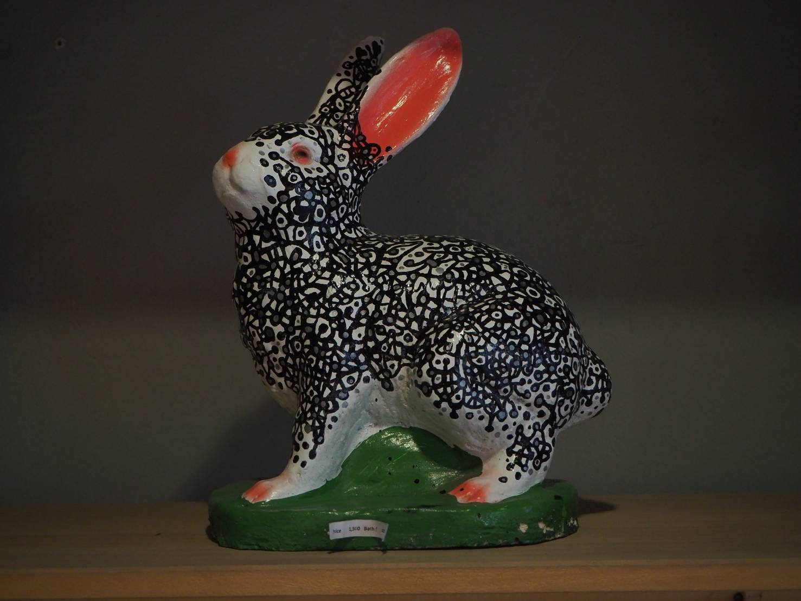

<!DOCTYPE html>
<html lang="th">
<head>
<meta charset="UTF-8">
<meta name="viewport" content="width=device-width, initial-scale=1.0">
<title>Plern Everyday Furniture</title>

<link rel="preconnect" href="https://fonts.googleapis.com">
<link rel="preconnect" href="https://fonts.gstatic.com" crossorigin>
<link href="https://fonts.googleapis.com/css2?family=Prompt:wght@300;400;500;700&display=swap" rel="stylesheet">

</head>

<body>

<header>

Plern

<nav>
<a href="#home">หน้าแรก</a>
<a href="#products">สินค้า</a>
<a href="#about">เกี่ยวกับเรา</a>
<a href="#contact">ติดต่อ</a>
</nav>
</header>

<section class="hero" id="home">

<h1>Make Home Feel Better</h1>

เฟอร์นิเจอร์อบอุ่นสำหรับทุกวัน สไตล์มินิมอล Earth Tone

<a href="#products" class="btn">ดูสินค้า</a>

</section>

<section id="products">
<h2 class="title">สินค้าแนะนำ</h2>

<h3>ชื่อสินค้า</h3>

ใส่รายละเอียดสินค้า

฿0

<h3>ชื่อสินค้า</h3>

ใส่รายละเอียดสินค้า

฿0

<h3>ชื่อสินค้า</h3>

ใส่รายละเอียดสินค้า

฿0

<h3>ชื่อสินค้า</h3>

ใส่รายละเอียดสินค้า

฿0

</section>

<section id="about">
<h2 class="title">เกี่ยวกับเรา</h2>

Plern Everyday Furniture คือร้านเฟอร์นิเจอร์ที่ออกแบบเพื่อการใช้ชีวิตจริง  
เรียบง่าย อบอุ่น เข้ากับทุกบ้าน และใช้งานได้ทุกวัน

วัสดุคุณภาพดี

ดีไซน์มินิมอล

ส่งทั่วประเทศ

บริการเป็นกันเอง

</section>

<section id="contact">
<h2 class="title">ติดต่อเรา</h2>

LINE : @yourline  
Facebook : Plern Everyday Furniture  
Instagram : @plern.everyday
 
<a href="#" class="line-btn">แชทสั่งซื้อ</a>

</section>

<footer>
© 2026 Plern Everyday Furniture
</footer>

</body>
</html>
